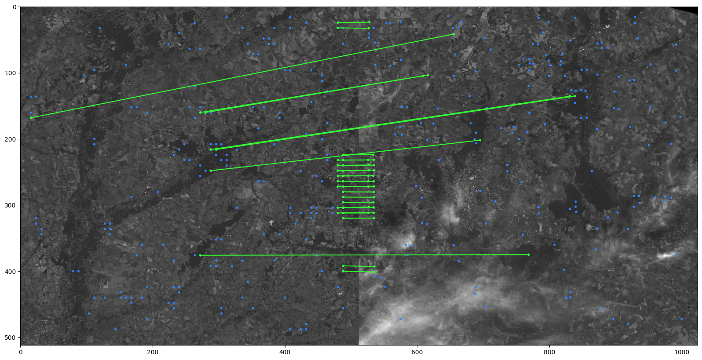

# Task 2. Computer vision. Sentinel-2 image matching
In this task, we will work on the algorithm (or model) for matching satellite images.



# Dataset
The dataset used was [Deforestation in Ukraine from Sentinel2 data](https://www.kaggle.com/datasets/isaienkov/deforestation-in-ukraine)

Processed dataset you can get [here](https://drive.google.com/file/d/1nD19p2EBqtgutXVKQcNKoVKozkfPBvCx/view?usp=sharing)

# Folder structure
- `dataset.ipynb` - notebook with dataset generation
- `model.py` - Definition of image matching model
- `inference.py` - code for model inference
- `demo.ipynb` - notebook with model demonstration

# Model
[**Pretrained LoFTR**](https://zju3dv.github.io/loftr/) on outdoor images was used for image matching

# How to run
- install all dependencies
```
pip install -r requirements.txt
```
- to try out the model, download the dataset from [here](https://drive.google.com/file/d/1nD19p2EBqtgutXVKQcNKoVKozkfPBvCx/view?usp=sharing), unpack the archive and put "image_dataset" folder in folder "task 2"
- to run demo:
```
python inference.py
```
Also you can try out the model in `demo.ipynb`